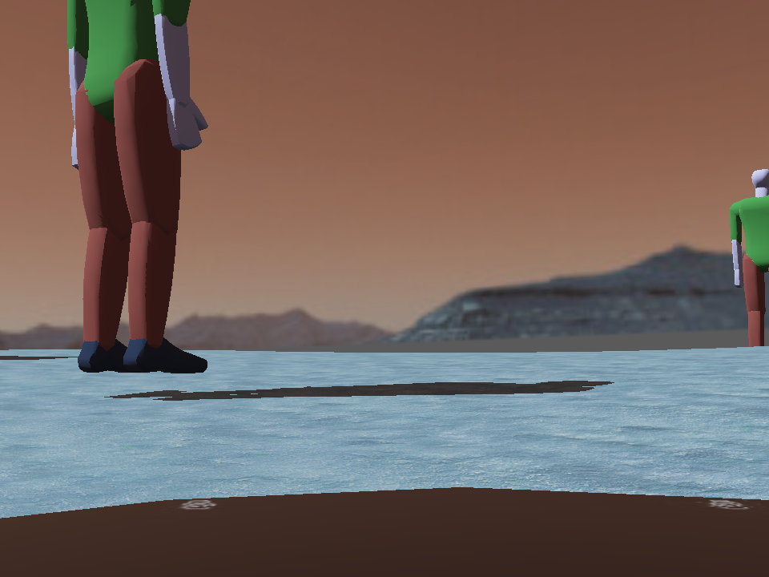
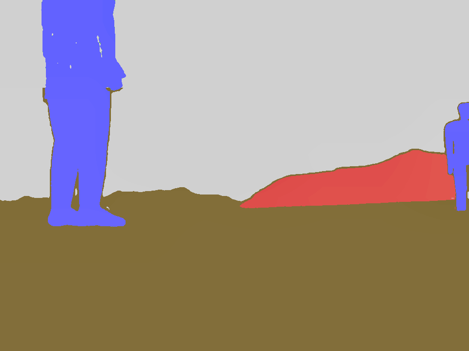
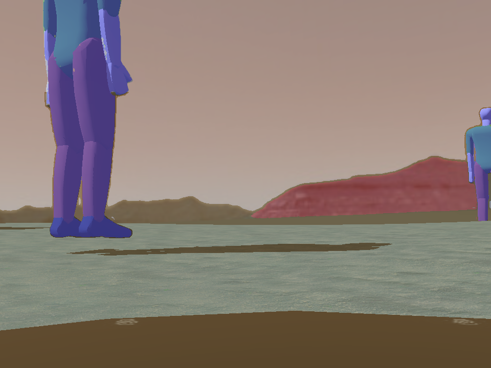
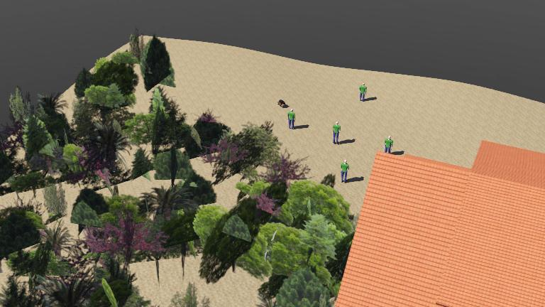
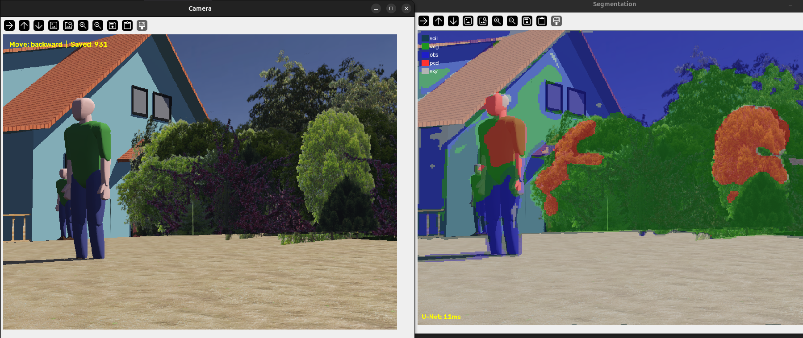

# Semantic Segmentation for Autonomous Agricultural Robots

[](https://www.python.org/)
[](https://pytorch.org/)
[](LICENSE)
[](https://cyberbotics.com/)

U-Net semantic segmentation for autonomous agricultural robots with auto-generated labels via GroundingDINO + SAM.

## Overview

This project segments agricultural scenes into **5 terrain classes**:

| Class ID | Class Name   | Color  | Description                    |
|----------|-------------|--------|--------------------------------|
| 0        | Soil        | Brown  | Sandy ground, dirt paths       |
| 1        | Vegetation  | Green  | Trees, bushes, plants          |
| 2        | Obstacle    | Red    | Buildings, walls, fences       |
| 3        | Pedestrian  | Blue   | People, humans                 |
| 4        | Sky         | Gray   | Sky, clouds                    |

## Dataset Samples

The dataset consists of 888 image-mask pairs collected from Webots simulation. Below are 3 representative samples showing the input image, auto-generated segmentation mask, and overlay visualization. The full dataset is availabe at https://drive.google.com/drive/folders/1T9Ag3O7-WQAblQ1ftHho6TYSOaTJ--nL?usp=sharing

### Sample 1

| Input Image | Segmentation Mask | Overlay |
|:-----------:|:-----------------:|:-------:|
|  |  |  |

### Sample 2

| Input Image | Overlay |
|:-----------:|:-------:|
|  |  |

### Dataset Statistics

- **Total images**: 908 raw frames collected from simulation
- **Labeled pairs**: 888 image-mask pairs after auto-labeling
- **Resolution**: 960x720 (native), resized to 256x256 for training
- **Split**: 85% train (754 images) / 15% validation (134 images)
- **Labeling method**: GroundingDINO + SAM (fully automated, no manual annotation)

## File Structure

```
unet_agricultural_segmentation/
├── README.md                    # This file
├── LICENSE                      # MIT License
├── .gitignore                   # Git ignore rules
├── paper.tex                    # LaTeX research paper
│
├── controllers/
│   └── unet/
│       ├── unet_model.py        # U-Net architecture definition
│       ├── collect_data.py      # Data collection controller (Webots)
│       ├── label_data.py        # Auto-labeling with GroundingDINO + SAM
│       ├── train.py             # Training pipeline with augmentation
│       ├── unet.py              # Active segmentation controller (real-time)
│       ├── unet_checkpoint.pth  # Best model checkpoint (download)
│       └── unet_final.pth       # Final model checkpoint (download)
│
├── dataset/
│   ├── images/                  # Raw camera images from simulation
│   │   ├── frame_00000.png      # Sample included in repo
│   │   └── ...                  # (1246 total, download full dataset)
│   ├── masks/                   # Auto-generated segmentation masks
│   │   ├── frame_00000.png      # Sample included in repo
│   │   └── ...                  # (888 masks, download full dataset)
│   ├── overlays/                # Color overlay visualizations
│   │   ├── frame_00000.png      # Sample included in repo
│   │   └── ...                  # (888 overlays, download full dataset)
│   └── make_visible.py          # Utility to enhance mask visibility
│
├── figures/
│   ├── sample_image.png         # Example input image
│   ├── sample_mask.png          # Example raw mask
│   ├── sample_mask_enhanced.png # Example enhanced mask
│   ├── sample_overlay.png       # Example overlay
│   ├── sample_overlay_final.png # Example final overlay
│   ├── semantic_seg.png         # Full segmentation interface
│   └── simulation.jpg           # Webots simulation screenshot
│
├── models/
│   ├── GroundingDINO_SwinT_OGC.py  # GroundingDINO config
│   ├── groundingdino_swint_ogc.pth # GroundingDINO weights (download)
│   └── sam_vit_b_01ec64.pth        # SAM weights (download)
│
├── worlds/
│   └── unet_arch.wbt            # Webots simulation world file
│
├── libraries/                   # External libraries (empty)
├── plugins/                     # Webots plugins
│   ├── physics/
│   ├── remote_controls/
│   └── robot_windows/
└── protos/                      # Webots prototypes (empty)
```

## Results

| Epoch | Train Loss | Val Loss | Val IoU | Val Dice |
|-------|-----------|----------|---------|----------|
| 1     | 1.3826    | 1.2112   | 0.2707  | 0.3662   |
| 25    | 1.0744    | 0.8996   | 0.3949  | 0.5033   |
| 50    | 0.9672    | 0.8467   | 0.3772  | 0.4912   |
| 75    | 0.9027    | **0.7813** | **0.4411** | **0.5497** |
| 100   | 0.8737    | 0.7608   | 0.4245  | 0.5379   |

**Best validation IoU: 0.4411 at epoch 75**

## Installation

### Prerequisites

- Python 3.10+
- CUDA-capable GPU (NVIDIA RTX 4060 or better recommended)
- Webots R2025a (for data collection and simulation)

### Setup

```bash
# Clone the repository
git clone https://github.com/dev-prashanna/Image-Segmentation-Naterida.git
cd Image-Segmentation-Naterida

# Create conda environment
conda create -n seg python=3.10
conda activate seg

# Install dependencies
pip install torch torchvision --index-url https://download.pytorch.org/whl/cu130
pip install albumentations opencv-python numpy scikit-learn scipy
pip install groundingdino-py segment-anything
```

### Download Model Weights

Download the required model weights and place them in the `models/` directory:

```bash
# GroundingDINO weights (~694MB)
wget -P models/ https://huggingface.co/ShilongLiu/GroundingDINO/resolve/main/groundingdino_swint_ogc.pth

# SAM ViT-B weights (~375MB)
wget -P models/ https://dl.fbaipublicfiles.com/segment_anything/sam_vit_b_01ec64.pth
```

### Download Full Dataset

```bash
# The full dataset (1246 images, 888 masks, 888 overlays) is available separately.
# Place extracted files in the dataset/ directory structure shown above.
```

## Usage

### Step 1: Data Collection

Run the data collection controller in Webots to collect camera images:

```bash
# Open unet_arch.wbt in Webots, then run:
python controllers/unet/collect_data.py
```

### Step 2: Auto-Labeling

Generate segmentation masks using GroundingDINO + SAM:

```bash
python controllers/unet/label_data.py
```

### Step 3: Training

Train the U-Net model with augmentation:

```bash
python controllers/unet/train.py
```

Training runs for 100 epochs on 256x256 images. Best checkpoint saved to `controllers/unet/unet_checkpoint.pth`.

### Step 4: Active Segmentation

Run real-time segmentation on the robot's camera feed:

```bash
# Open unet_arch.wbt in Webots, then run:
python controllers/unet/unet.py
```

Displays two windows: raw camera feed (left) and color-coded segmentation overlay (right).

## Training Configuration

| Parameter           | Value                                      |
|--------------------|---------------------------------------------|
| Image resolution   | 256 x 256                                   |
| Input channels     | 3 (RGB)                                     |
| Output classes     | 5 (soil, vegetation, obstacle, pedestrian, sky) |
| Batch size         | 4                                           |
| Epochs             | 100                                         |
| Learning rate      | 1e-4 (initial)                              |
| LR scheduler       | Cosine annealing (min=1e-6)                 |
| Optimizer          | AdamW (weight_decay=1e-5)                   |
| Loss function      | Weighted CrossEntropyLoss                   |
| Augmentation       | HorizontalFlip, VerticalFlip, RandomRotate90, Affine, CLAHE, GaussNoise, GaussianBlur, ElasticTransform, GridDistortion, OpticalDistortion |

## Hardware

- **GPU**: NVIDIA GeForce RTX 4060 Laptop (8GB VRAM)
- **CUDA**: 13.0
- **Training time**: ~15-20 minutes for 100 epochs

## Limitations

1. Simulated data only (Webots) - domain gap with real-world images
2. Auto-label noise from GroundingDINO + SAM
3. Moderate IoU (0.44) - sufficient for terrain assessment but not safety-critical navigation
4. Fixed 256x256 resolution loses fine details from original 960x720
5. Single environment configuration

## Future Work

- Real-world data collection and fine-tuning
- Model architecture improvements (DeepLabv3+, SegFormer)
- Higher resolution training with patch-based approaches
- Edge deployment optimization (TorchScript, ONNX, INT8 quantization)
- Integration with NATERIDA robotic platform
- Active learning for selective annotation

## Citation

If you use this work, please cite:

```bibtex
@article{tiwari2026unet,
  title={Semantic Segmentation for Autonomous Agricultural Robots: A U-Net Approach with Auto-Generated Labels},
  author={Tiwari, Prashanna},
  year={2026}
}
```

## License

This project is licensed under the MIT License - see the [LICENSE](LICENSE) file for details.

The MIT License gives you full liberty to use, modify, and distribute this software for any purpose, including commercial use, provided the original copyright notice is included.

## References

- Ronneberger et al. (2015). U-Net: Convolutional Networks for Biomedical Image Segmentation. *MICCAI*.
- Liu et al. (2024). Grounding DINO: Marrying DINO with Grounded Pre-Training for Open-Set Object Detection. *ECCV*.
- Kirillov et al. (2023). Segment Anything. *ICCV*.
- [Webots Robot Simulator](https://cyberbotics.com/)
- [NATERIDA Project](https://github.com/DeV-PrasiddhA/NATERIDA)

## Acknowledgments

- **NATERIDA microbots** project by Prasiddha Mainali, Prashanna Tiwari, and Prince Kumar Mandal
- **U-Net** architecture by Ronneberger et al. (2015)
- **GroundingDINO** by Liu et al. (2024)
- **Segment Anything Model (SAM)** by Kirillov et al. (2023)
- **Webots** robot simulator by Olivier Michel
